# Fill your belly, feed your soul

The Live Website can be accessed [HERE!](https://fillyourbelly.herokuapp.com/)

This is a recipe website that is open to everyone who loves cooking and wants to explore new recipes. The site’s main purpose is to allow users to browse and view recipes whether they are registered or not. Registered users can also add, update and delete their own recipes on the app, like or dislike recipes, and leave comments that can be updated or deleted by the user.

## Table of Contents
- [Fill your belly, feed your soul](#fill-your-belly-feed-your-soul)
  - [Table of Contents](#table-of-contents)
  - [Features](#features)
    - [Existing Features](#existing-features)
      - [Home Page](#home-page)
      - [Recipes Page](#recipes-page)
      - [Add Recipes Page](#add-recipes-page)
      - [Recipe Details Page](#recipe-details-page)
      - [Edit Recipe Page](#edit-recipe-page)
      - [Delete Recipe Page](#delete-recipe-page)
      - [Comments section](#comments-section)
      - [User Account Pages](#user-account-pages)
      - [Admin Control](#admin-control)
    - [Future Features](#future-features)
  - [UX](#ux)
    - [Site Purpose](#site-purpose)
    - [Agile Methodology](#agile-methodology)
    - [User Stories](#user-stories)
  - [Design](#design)
    - [Flow Diagram](#flow-diagram)
  - [Testing](#testing)
    - [User Testing](#user-testing)
    - [Manual Testing](#manual-testing)
    - [Bugs to fix](#bugs-to-fix)
  - [Technologies Used](#technologies-used)
  - [Deployment](#deployment)
    - [Github](#github)
    - [Django and Heroku](#django-and-heroku)
      - [Final Deployment](#final-deployment)
    - [How to Fork it](#how-to-fork-it)
    - [How to Clone it](#how-to-clone-it)
    - [Making a Local Clone](#making-a-local-clone)
  - [Credits](#credits)

## Features
### Existing Features
#### Home Page

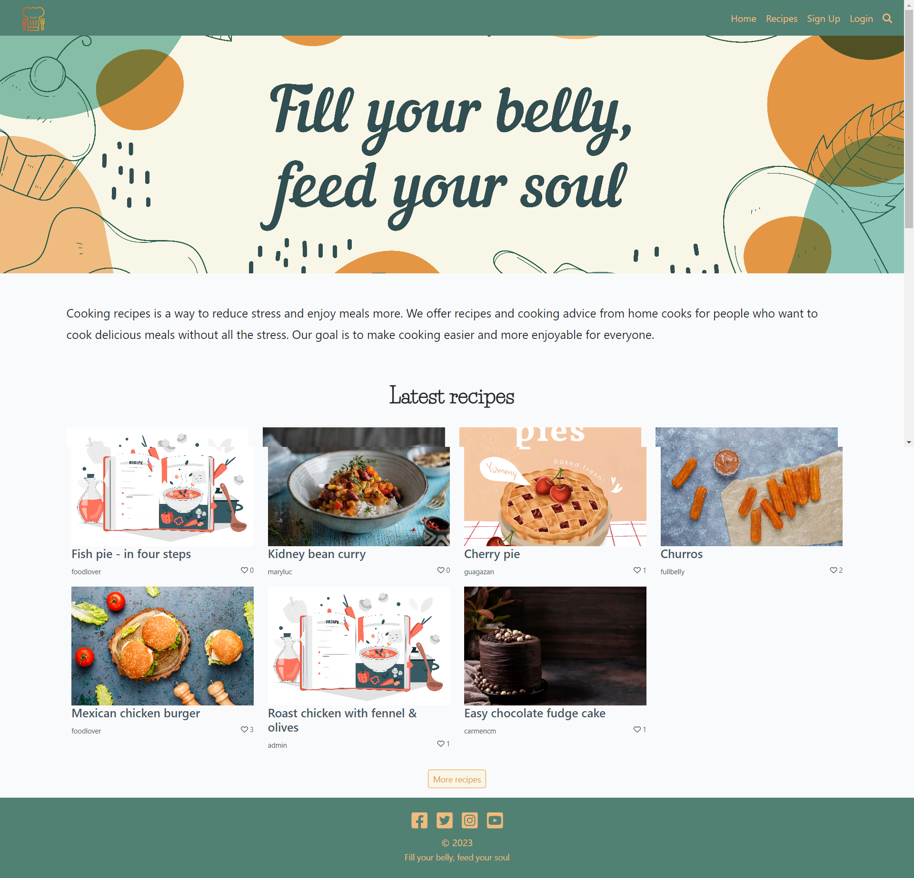

#### Recipes Page

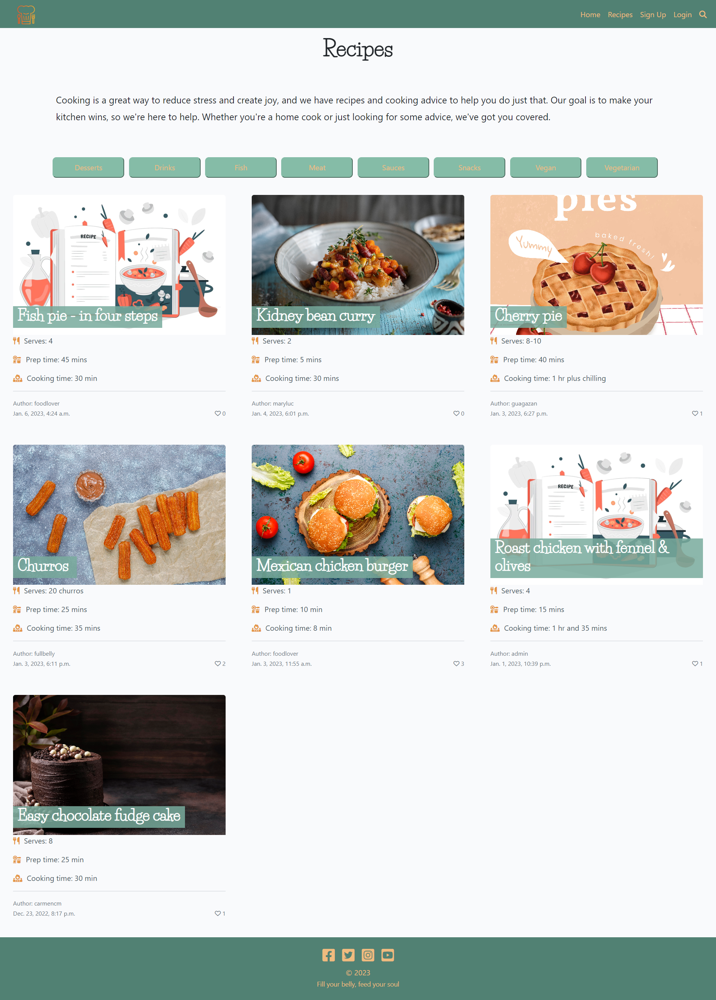

#### Add Recipes Page

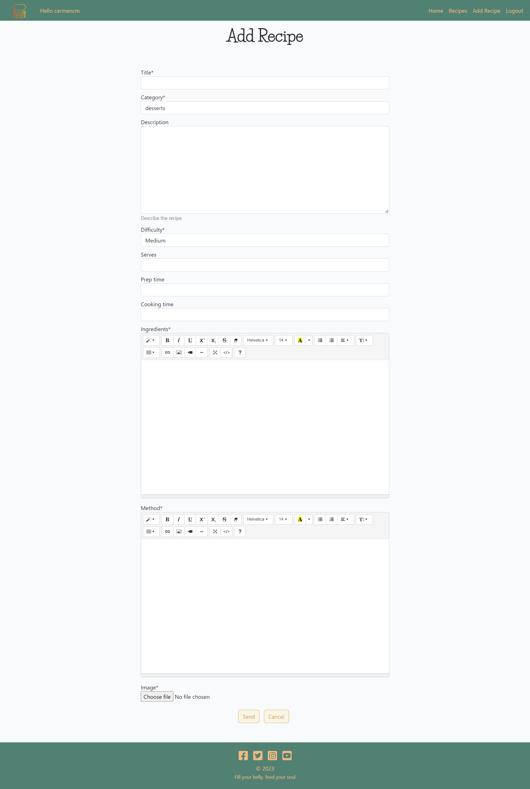

#### Recipe Details Page

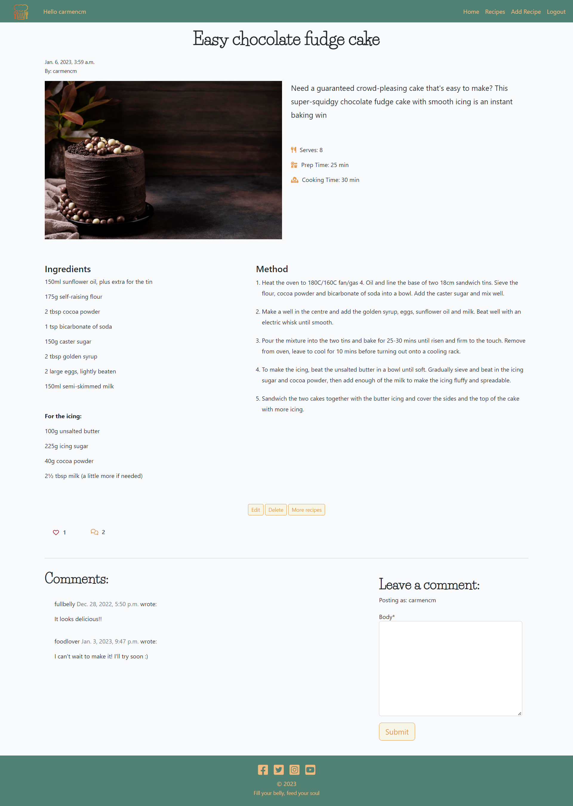

#### Edit Recipe Page

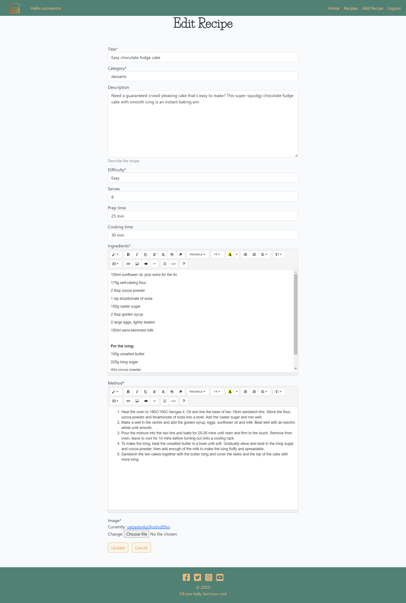

#### Delete Recipe Page

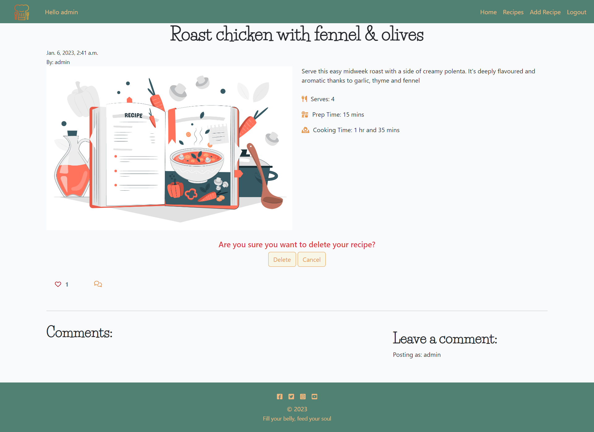

#### Comments section

  
Comments section

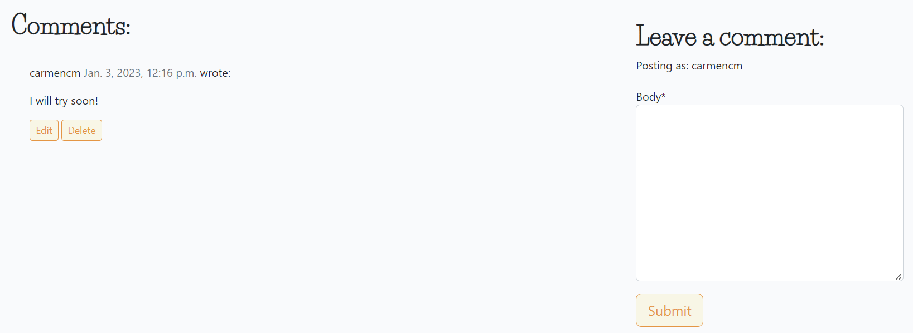

- Leave a comment

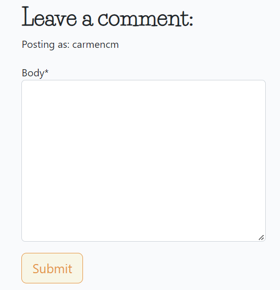

- Comment Approval

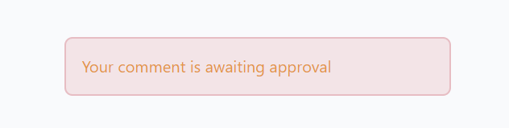

- Edit Comment Page

- Delete Comment Page

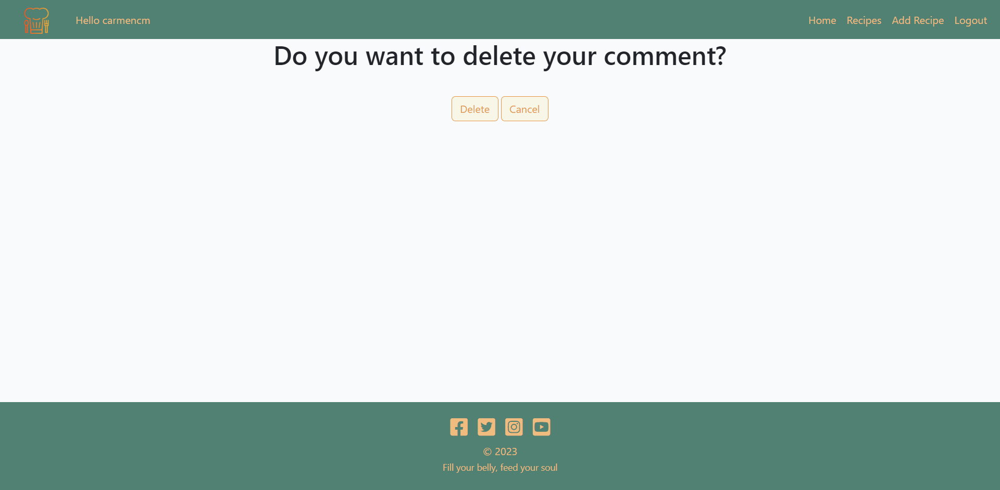

#### User Account Pages

  
User Account Pages

- Register page

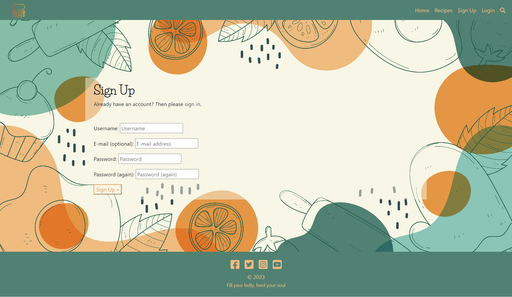

- Login page
  

- Logout page

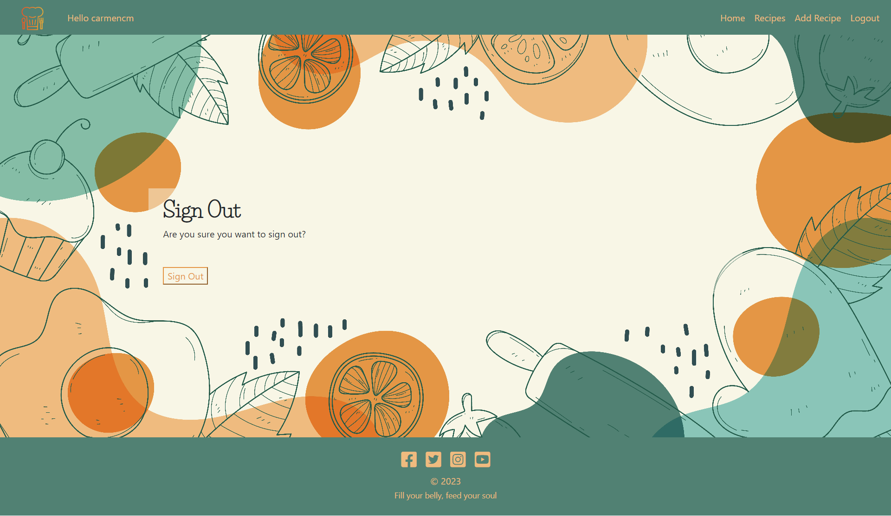

#### Admin Control

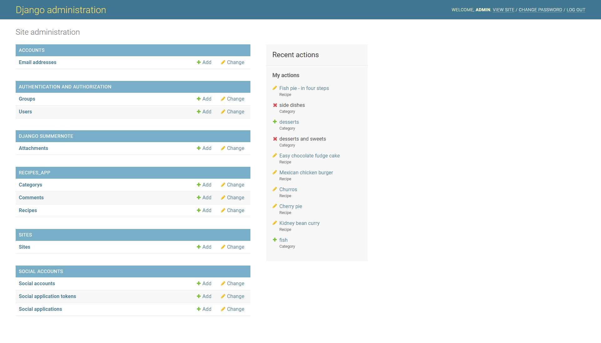

[Back to top](#fill-your-belly-feed-your-soul)

### Future Features

- Create new categories.
- Create a profile page.
- Save favourite recipes in user's profile.
- List of created recipes in user's profile.

[Back to top](#fill-your-belly-feed-your-soul)

## UX
### Site Purpose
- To make the app user-friendly and aesthetically pleasing while still meeting the needs of the user. 
- The app is designed for anyone who enjoys cooking and wants to find recipes and cooking tips.
- To have a website where you can view recipes and choose one to cook.
- To make sure that everyone who visits our website finds recipes they'll love, so we've put together a list of great food-related ideas.
- This app allows you to create, update, and delete your recipes.
- To allow users to approve, update and delete their recipes.
- To give the admin user the power to approve, update, and delete recipes.
- To respond to user inputs and actions in a clear and accurate way.

### Agile Methodology

The Agile Methodology was used to plan and manage this project. Issues were created on Github so that tasks could be assigned and prioritised usign the Project Board. A User Story was created for each task, with specific requirements and deadlines.

### User Stories

- USER STORY: View recipe list
  
  As a Site User I can view a list of recipes so that I can select one to read.

- USER STORY: Manage recipes
  
  As a Site User / Admin I can create, read, update and delete recipes so that I can manage recipes.

- USER STORY: Likes
  
  As a Site User / Admin I can like / unlike recipes so that anybody can see which is the most popular.

- USER STORY: Update / Delete Comments
  
  As a Site User I can update and delete comments on a recipe so that I can edit or remove any comments I've posted

- USER STORY: View / Leave Comments
  
  As a Site User I can view and leave comments on a recipe so that I can learn more about the recipe and participate in the conversation.

- USER STORY: Account Registration / Login
  
  As a Site User I can register and log into an account so that I can add recipes, comment on them and like them.

- USER STORY: Create drafts
  
  As a Site User I can create draft recipes so that I can finish writing the content later.

- USER STORY: Open a recipe
  
  As a Site User I can open a recipe so that I can read the recipe's steps, ingredients and comments.

- USER STORY: Search recipes
  
  As a Site User I can search for recipes so that I can select one to read.

- USER STORY: Site pagination

  As a Site User I can view a paginated list of recipes so that I can easily select a recipe to view.

[Back to top](#fill-your-belly-feed-your-soul)

## Design

The colour scheme for the design of the website is based in the banner image.

### Flow Diagram

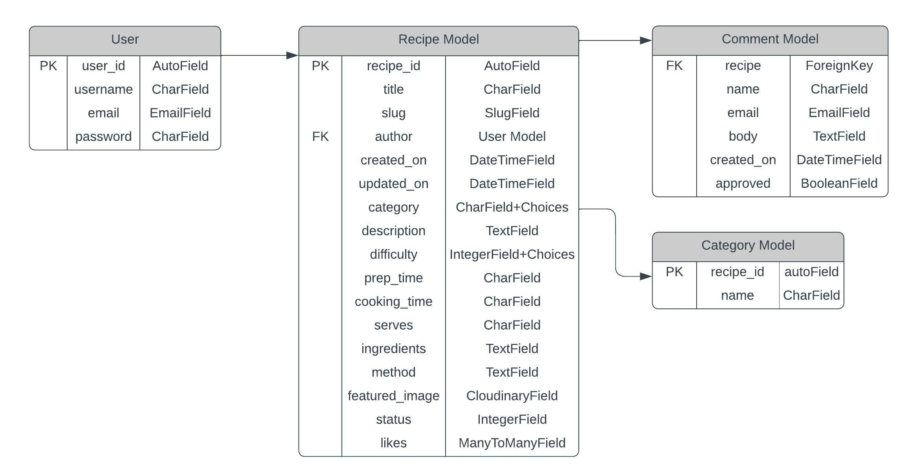

The flow chart above, created with the website [Lucidchart](https://lucid.app/), provides a simplified overview of what I was trying to accomplish.

## Testing

The website was constantly tested during development.

### User Testing

- User Testing:
  
  - Expectations:
  
  The user expects the app to provide an appropriate landing page that welcomes them, engages them with relevant information, and provides clear navigation to help them make choices (read, add, edit, delete recipes and comments). They also expect easy-to-follow navigation that is clear and concise, so they can easily find the information they are looking for. If there is a problem, the user expects to be notified and given instructions on how to fix it.

  - Result:

  The app's landing page was appropriate and welcoming, and the home page let me know what the app was about and what its features were. The navigation was easy to follow and I could understand everything on each page. The information was clear and I could make choices about what I wanted to do (read, add, edit, delete recipes and comments). When I made a mistake, I was told what I needed to do and given directions on how to fix the problem.

### Manual Testing

| **Navigation Bar** | Status
|:-------:|:--------|
| Click on navbar logo loads home page | &check;
| Click on the Home tab loads the home page | &check;
| Click on the Recipes tab loads the recipe page | &check;
| Click on Login loads the login page | &check;
| Click on Signup loads the signup page | &check;
| Click on Logout loads the logout page | &check;
| Click on Add Recipe loads the add recipe page | &check;

| **Navigation Footer** | Status
|:-------:|:--------|
| Click on Facebook Icon opens external Tab | &check;
| Click on Twitter opens external Tab | &check;
| Click on Instagram opens external Tab | &check;
| Click on Youtube opens external Tab | &check;

| **Home Page** | Status
|:-------:|:--------|
| Sign up and Login visible when logged out | &check;
| Logout and Add recipes visible when logged in | &check;
| Username visible when logged in | &check;
| The latest 8 recipes added are shown | &check;

| **Recipes Page** | Status
|:-------:|:--------|
| All the recipes are visible | &check;
| When a category is clicked it shows the recipes in it | &check;

| **Categories Navigation** | Status
|:-------:|:--------|
| It shows all the  categories added | &check;
| When a category is clicked it shows the recipes in it | &check;

| **Recipe details Page** | Status
|:-------:|:--------|
| All the recipe details are visible | &check;
| Click on edit recipe loads the edit recipe page | &check;
| Click on delete recipe loads the delete recipe page | &check;
| The comments are visible | &check;
| The leave a comment section is visible | &check;
| Click on submit comment sends the comment for review | &check;
| Click on edit comment loads the edit comment page | &check;
| Click on delete comment loads the delete comment page | &check;
| Click on more recipes redirects to the recipe page | &check;

| **Add Recipe Page** | Status
|:-------:|:--------|
| All the fields are visible | &check;
| Type in fields lets you write | &check;
| Ingredients and Method fields uses Summernote | &check;
| Click on Select an Image file button uploads an image | &check;
| If an Image file is not selected it shows a placeholder image | &check;
| Click on Submit button sends the form for approval | &check;
| Click on Cancel button cancels and redirects to the recipe page | &check;

| **Likes and Comments** | Status
|:-------:|:--------|
| Click on Like/Unlike only works when logged in | &check;
| Comments can be left only when logged in | &check;
| The recipes show the number of comments | &check;

### Bugs to fix

After sending a comment, if a user wants to send another comment it shows an error.

[Back to top](#fill-your-belly-feed-your-soul)

## Technologies Used

- HTML: Used to structure all the templates on the site.
- CSS: To provide extra styling to the site.
- Python: To provide the functionality to the site. Packages used in the project can be found in requirements.txt.
- Django: Python framework used in the project.
- Javascript: Minimum javascript was used to fade out alerts.
- Bootstrap 4: To create layouts and styles for the website.
- [GitHub](https://github.com/): Used to store my repository for submission.
- [Gitpod](https://gitpod.io/): Used to develop the application.
- GitBash: Used to push the repository to Github.
- [Heroku](https://www.heroku.com/): Used to deploy the website.
- [ElephantSQL](https://www.elephantsql.com/): Used for the database during development and deployment.
- [Cloudinary](https://cloudinary.com/): To host Static files for the site.
- [Lucidchart](https://www.lucidchart.com/): Used to make a flow diagram to help with the logic & flow of the code.
- [Balsamiq](https://balsamiq.com/): To create wireframes for the project.
- [Am I Responsive?](https://ui.dev/amiresponsive): To ensure the project looked good across all devices.
- [Favicon](https://favicon.io/favicon-converter/) - To create the favicon icon.

[Back to top](#fill-your-belly-feed-your-soul)

## Deployment

### Github 

To create a new repository, I took the following steps:

1. Logged into GitHub.
2. Click the ‘repositories’ section.
3. Click the green ‘new’ button to create new repository.
4. Choose ‘repository template’ Used the code institute template as recommended from the dropdown menu.
5. Add repository name then clicked the green ‘create repository button’ at the bottom of the page.
6. Open the new repository and clicked the green ‘Gitpod’ button to create a workspace in Gitpod for editing.

### Django and Heroku

To get the Django framework installed and set up I followed the Code institute [I Think Therefore I Blog cheatsheet](https://docs.google.com/document/d/1P5CWvS5cYalkQOLeQiijpSViDPogtKM7ZGyqK-yehhQ/edit).

#### Final Deployment 
    DEBUG = False

    X_FRAME_OPTIONS = 'SAMEORIGIN' 

    In Heroku go to Reveal Congfig Vars  
    Remove Disbable_Collectstatic

    Go to Deploy Tab & Deploy Branch

### How to Fork it
1. On GitHub, go to [CarmenCantudo/recipes]( https://github.com/CarmenCantudo/recipes).
2. In the top right, click "Fork".

### How to Clone it
1. Go to the main page of the repository.
3. Above the file list, click "Code".
4. Select HTTPS, SSH, or GitHub CLI and then click copy to clone it.
5. Open Git Bash.
6. Change the location of your cloned repository.
7. Type `git clone` and then paste the URL you copied.
8. Press “Enter” to create your clone.

### Making a Local Clone
1. Locate the [Repository]( https://github.com/CarmenCantudo/recipes).
2. Click "Code".
3. Click Clone or Download.
4. Copy the Git URL from the dialogue box.
5. Open a terminal window in your choosen directory using your preferred development editor.
6. Change the location to where you want the cloned directory to be.
7. Type `git clone`, and then paste the URL you copied.
8. Press Enter, and your local clone will be created.

[Back to top](#fill-your-belly-feed-your-soul)

## Credits

Resources used in the process of the "Fill your belly, feed your soul" website design and build:
- [Create A Simple Django Blog | Codemy.com](https://www.youtube.com/playlist?list=PLCC34OHNcOtr025c1kHSPrnP18YPB-NFi)
- [StackOverFlow](https://stackoverflow.com/): Help with general questions.
- I think therefore I blog Code Institute project.
- [Images and icon](https://www.freepik.com/).

[Back to top](#fill-your-belly-feed-your-soul)